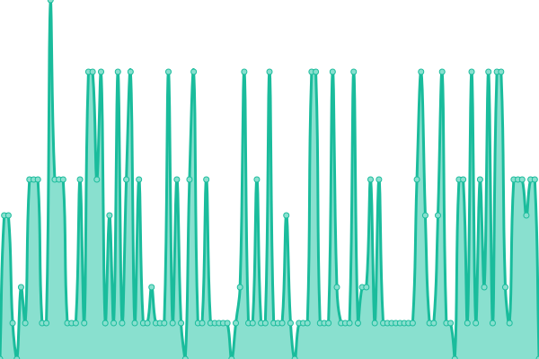
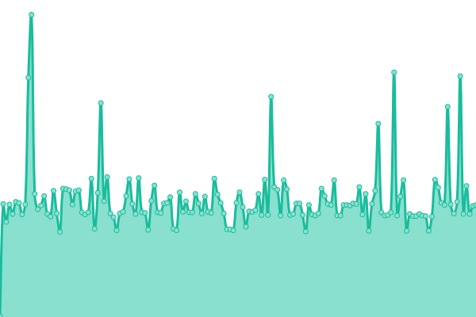
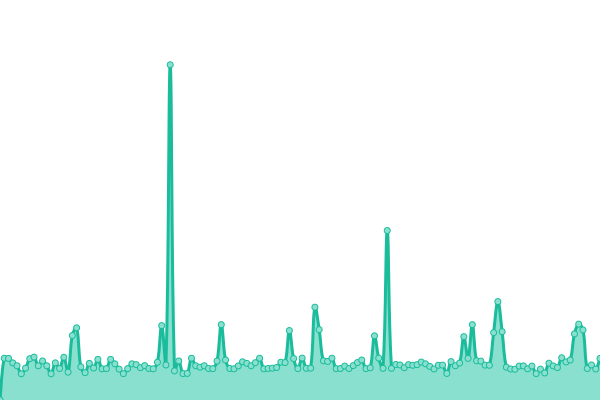
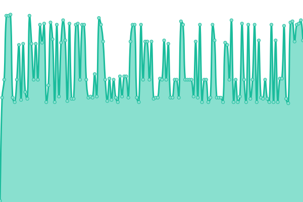

# [📈 Live Status](https://Amirabbas100.github.io/uptime-robot): <!--live status--> **🟧 Partial outage**

This repository contains the open-source uptime monitor and status page for [Amirabbas100](https://Amirabbas100.github.io/uptime-robot), powered by [Upptime](https://github.com/upptime/upptime).

With [Upptime](https://upptime.js.org), you can get your own unlimited and free uptime monitor and status page, powered entirely by a GitHub repository. We use [Issues](https://github.com/Amirabbas100/uptime-robot/issues) as incident reports, [Actions](https://github.com/Amirabbas100/uptime-robot/actions) as uptime monitors, and [Pages](https://Amirabbas100.github.io/uptime-robot) for the status page.

<!--start: status pages-->
<!-- This summary is generated by Upptime (https://github.com/upptime/upptime) -->
<!-- Do not edit this manually, your changes will be overwritten -->
<!-- prettier-ignore -->
| URL | Status | History | Response Time | Uptime |
| --- | ------ | ------- | ------------- | ------ |
|  [Website](ELTeam.ir) | 🟩 Up | [website.yml](https://github.com/SIRMaxis/uptime-robot/commits/HEAD/history/website.yml) | 

 50ms
     
 | 

<a href="https://status.elteam.ir/history/website">100.00%</a>
    

|  [DNS1.electro](ns1.elteam.ir) | 🟥 Down | [dns-1-electro.yml](https://github.com/SIRMaxis/uptime-robot/commits/HEAD/history/dns-1-electro.yml) | 

 0ms
     
 | 

<a href="https://status.elteam.ir/history/dns-1-electro">0.00%</a>
    

|  [DNS2.electro](ns2.elteam.ir) | 🟥 Down | [dns-2-electro.yml](https://github.com/SIRMaxis/uptime-robot/commits/HEAD/history/dns-2-electro.yml) | 

 0ms
     
 | 

<a href="https://status.elteam.ir/history/dns-2-electro">0.15%</a>
    

|  [DE Server](de1.elteam.ir) | 🟥 Down | [de-server.yml](https://github.com/SIRMaxis/uptime-robot/commits/HEAD/history/de-server.yml) | 

 165ms
     
 | 

<a href="https://status.elteam.ir/history/de-server">54.88%</a>
    

<!--end: status pages-->

[**Visit our status website →**](https://sirmaxis.github.io/uptime-robot)

## 📄 License

- Powered by: [Upptime](https://github.com/upptime/upptime)
- Code: [MIT](./LICENSE) © [SIRMAXIS](https://sirmaxis.github.io/uptime-robot)
- Data in the `./history` directory: [Open Database License](https://opendatacommons.org/licenses/odbl/1-0/)
